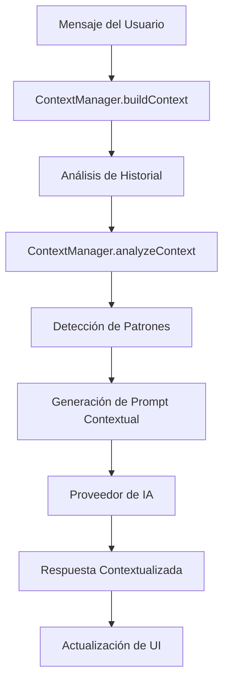

# Sistema de Memoria Contextual de Conversación

## Descripción General

El sistema de memoria contextual implementa una funcionalidad inteligente que permite al chat mantener un contexto de las conversaciones previas, evitando repeticiones y enriqueciendo las nuevas preguntas con información histórica relevante.

## Características Principales

### 🧠 Memoria Inteligente
- **Contexto Limitado**: Mantiene las últimas 12 mensajes para optimizar el rendimiento
- **Análisis de Patrones**: Identifica patrones en las conversaciones (pregunta-respuesta, exploración, recomendación)
- **Detección de Sentimiento**: Analiza el tono de la conversación (positivo, preocupado, neutral)

### 🎯 Evitación de Repetición
- **Detección de Temas**: Identifica automáticamente las categorías de desarrollo ya cubiertas
- **Control Temporal**: Evita repetir preguntas sobre los mismos temas en un período de 2 horas
- **Sugerencias Inteligentes**: Propone nuevos temas no explorados

### 📊 Análisis Contextual
- **Resumen de Conversación**: Genera un resumen automático de los temas discutidos
- **Insights Contextuales**: Extrae información clave de los mensajes del usuario
- **Flujo de Conversación**: Analiza el patrón de interacción entre usuario y asistente

## Arquitectura del Sistema

### Componentes Principales

#### 1. ContextManager (`services/contextManager.ts`)
```typescript
// Construye el contexto inteligente
const context = ContextManager.buildContext(messages);

// Analiza el contexto para generar sugerencias
const analysis = ContextManager.analyzeContext(context);

// Crea un prompt contextualizado
const prompt = ContextManager.createContextualPrompt(
  childName, childAge, context, analysis, userMessage
);
```

#### 2. Hook useConversationContext (`hooks/useConversationContext.ts`)
```typescript
const {
  context,
  analysis,
  updateContext,
  hasRecentConversation,
  suggestedTopics,
  shouldAvoidRepetition
} = useConversationContext();
```

#### 3. Componentes UI
- **ConversationContextCard**: Muestra información contextual en la interfaz principal
- **ChatWindow**: Integra indicadores de contexto en el chat

### Flujo de Funcionamiento



## Configuración

### Parámetros Configurables

```typescript
// En ContextManager
private static readonly MAX_CONTEXT_MESSAGES = 12;           // Máximo de mensajes en contexto
private static readonly MIN_MESSAGES_FOR_ANALYSIS = 3;       // Mínimo para análisis
private static readonly REPETITION_THRESHOLD_HOURS = 2;      // Umbral de repetición
```

### Prompts Centralizados

Todos los prompts del sistema están centralizados en `prompts.ts`:

- **SYSTEM_PROMPT**: Prompt principal del sistema
- **GET_INITIAL_QUESTION_PROMPT**: Para generar preguntas iniciales
- **GET_STIMULATION_SUGGESTION_PROMPT**: Para sugerencias de estimulación
- **CONTEXTUAL_CONVERSATION_PROMPT**: Para el sistema de memoria contextual

### Categorías de Desarrollo Monitoreadas

- **Language**: Habla, comunicación, expresión
- **Motor**: Movimiento, gateo, habilidades motoras
- **Social**: Interacción, contacto visual, sonrisas
- **Sleep**: Patrones de sueño, descanso
- **Feeding**: Alimentación, nutrición
- **Cognitive**: Comprensión, aprendizaje, memoria
- **Play**: Juegos, entretenimiento, diversión
- **Autonomy**: Independencia, autonomía

## Beneficios del Sistema

### Para el Usuario
- ✅ **Conversaciones más naturales**: El chat recuerda lo que se ha discutido
- ✅ **Evita repeticiones**: No hace las mismas preguntas constantemente
- ✅ **Preguntas más inteligentes**: Se basa en información previa para hacer preguntas más relevantes
- ✅ **Progresión lógica**: Sigue un flujo natural de conversación

### Para el Sistema
- ✅ **Optimización de tokens**: Limita el contexto para mantener eficiencia
- ✅ **Análisis inteligente**: Procesa patrones para mejorar la experiencia
- ✅ **Escalabilidad**: Sistema modular que puede extenderse fácilmente

## Ejemplos de Uso

### Escenario 1: Primera Conversación
```
Usuario: "Hola, mi hijo tiene 12 meses"
IA: "¡Hola! Cuéntame, ¿qué actividades disfruta más tu hijo de 12 meses?"
```

### Escenario 2: Conversación con Contexto
```
Usuario: "Hoy gateó por primera vez"
IA: "¡Qué emocionante! Recordando que mencionaste que le gusta explorar con las manos, 
     ¿has notado si ahora que gatea también muestra más interés en alcanzar objetos 
     que antes estaban fuera de su alcance?"
```

### Escenario 3: Evitando Repetición
```
// Si ya se habló sobre alimentación hace 1 hora
Usuario: "¿Qué más debería saber?"
IA: "Ya hemos hablado sobre su alimentación. ¿Te gustaría que exploremos su 
     desarrollo social? ¿Cómo interactúa con otras personas?"
```

## Integración con Proveedores de IA

### OpenAI Provider
```typescript
// Usa el prompt contextual centralizado desde prompts.ts
const contextualPrompt = ContextManager.createContextualPrompt(...);
const messages = [
  { role: 'system', content: `${SYSTEM_PROMPT}\n\n${contextualPrompt}` }
];
```

### Gemini Provider
```typescript
// Integra el contexto usando el prompt centralizado
const response = await this.ai.models.generateContent({
  model: 'gemini-2.5-flash',
  contents: contextualPrompt, // Usa CONTEXTUAL_CONVERSATION_PROMPT
  config: { systemInstruction: SYSTEM_PROMPT }
});
```

### Centralización de Prompts
Todos los prompts están ahora centralizados en `prompts.ts`:
- **CONTEXTUAL_CONVERSATION_PROMPT**: Template para prompts contextuales
- **SYSTEM_PROMPT**: Prompt base del sistema
- **GET_INITIAL_QUESTION_PROMPT**: Para preguntas iniciales
- **GET_STIMULATION_SUGGESTION_PROMPT**: Para sugerencias

## Monitoreo y Debugging

### Información Contextual Visible
- **Resumen de conversación**: Muestra los temas cubiertos
- **Temas sugeridos**: Indica qué categorías explorar
- **Estado de repetición**: Muestra si está evitando repetir temas
- **Contador de mensajes**: Indica la actividad de la sesión

### Logs de Desarrollo
```typescript
// El sistema registra automáticamente:
console.log('Context built:', context.conversationSummary);
console.log('Analysis:', analysis.suggestedTopics);
console.log('Avoiding repetition:', analysis.shouldAvoidRepetition);
```

## Futuras Mejoras

### Funcionalidades Planeadas
- 🔄 **Persistencia de contexto**: Guardar contexto entre sesiones
- 🎨 **Personalización de temas**: Permitir al usuario definir temas de interés
- 📈 **Métricas de conversación**: Análisis de patrones de uso
- 🔍 **Búsqueda en historial**: Buscar conversaciones anteriores
- 🤖 **Aprendizaje adaptativo**: Mejorar sugerencias basado en feedback

### Optimizaciones Técnicas
- ⚡ **Cache de contexto**: Optimizar el procesamiento de contexto
- 🧮 **Compresión de mensajes**: Reducir el tamaño del contexto
- 🔄 **Actualización incremental**: Solo procesar mensajes nuevos
- 📊 **Análisis en tiempo real**: Procesar contexto mientras el usuario escribe
